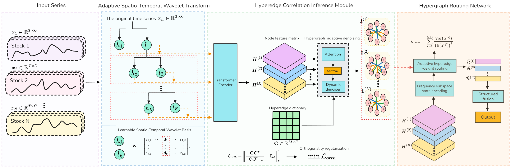

# WaveHGRN

The repo is the official implementation for the paper: "Adaptive Spatio-Temporal Wavelet Hypergraph Routing for Evolutionary Financial Risk Contagion (Under Review)". We will provide the optimal parameter configuration once the paper is accepted.

We gratefully acknowledge [AD-GAT](https://github.com/RuichengFIC/ADGAT) and [VGNN](https://github.com/JiwenHuangFIC/VGNN) for sharing their code; we primarily structured our procedures according to their settings.

## Abstract
The phenomenon of dynamic risk contagion within financial markets is of great importance for asset pricing and understanding market behaviour. Although Graph Neural Networks have recently emerged as the dominant approach for modelling inter-entity dependencies, existing models often fail to address the multi-scale complexity of risk signals and oversimplify contagion pathways. Consequently, they overlook the higher-order, heterogeneity and dynamic evolution inherent in risk propagation. To address these limitations, we propose the Wavelet-based Adaptive Hypergraph Routing Network (WaveHGRN) for multi-level and structured characterization of high-order risk. Specifically: (i) an adaptive spatio-temporal wavelet transform employs learnable spatio-temporal wavelet kernel to decompose market signals into hierarchical frequency subspaces in a manner that adapts to the implicit interactions among feature channels; (ii) a hyperedge correlation inference module derives frequency-specific high-order relationships and employs an adaptive denoiser to ensure the robustness of these latent network structures; and (iii) a hypergraph routing network uses frequency-specific states as semantic anchors to orchestrate multiple risk patterns, reconfiguring message passing mechanisms and ultimately achieving the logical synthesis of multi-scale features through bottom-up residual fusion. Extensive experiments on US and Chinese stock markets demonstrate that WaveHGRN significantly outperforms state-of-the-art baselines, providing a comprehensive and robust paradigm for modeling the evolution of financial risk contagion.

## Dataset
[https://pan.baidu.com/s/1rHzwyQYyvG_NU-aQH1aSGQ?pwd=g9ie](https://pan.baidu.com/s/16gY5tWgah8RlJg9swuo40A?pwd=8spj ) (This link contains the three Chinese market datasets and one US market dataset used.)

## Procedure

## Contact
If you have any questions, please contact the author [xiaosc123456@gmail.com](mailto:xiaosc123456@gmail.com).
